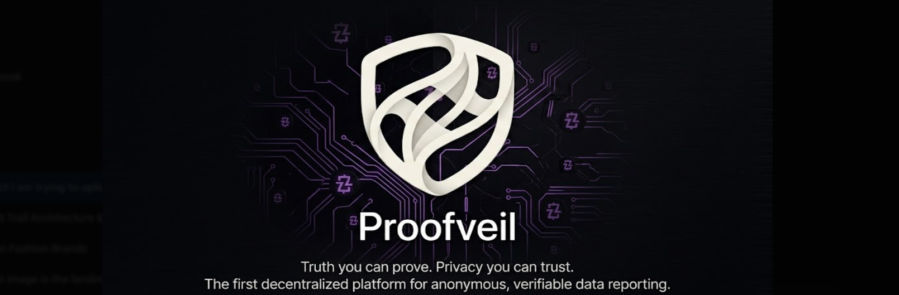

<div align="center">
 
<br/>
 

 
<br/><br/>
 
*ProofVeil is a Confidential Credentials platform built on the Midnight blockchain.*
*Submit a document. Get a zero-knowledge proof it's valid. Verify it later — without ever revealing what it is.*
 
<br/>

[](https://github.com/vaibhavi-0320/proofveil/actions/workflows/ci.yml)
[](https://midnight.network)
[](https://docs.midnight.network/compact)
[](https://react.dev)
[](https://typescriptlang.org)
[](https://vitejs.dev)
[](https://proofveil.vercel.app)
[](LICENSE)
[](PROPOSAL.md)
 
<br/>
 
[🎬 **Watch Demo**](https://www.loom.com/share/0f142365d8a449e88ebf015f17c7834e)
[🔴 **Live App**](https://proofveil.vercel.app) &nbsp;&nbsp;|&nbsp;&nbsp;
[📜 **Contract Source**](contracts/hello-world.compact) &nbsp;&nbsp;|&nbsp;&nbsp;
[📄 **Proposal**](PROPOSAL.md)
[🐙 **GitHub**](https://github.com/vaibhavi-0320/proofveil)
 
<br/>
 
</div>
 
---

## Midnight Hackathon — Level 3

ProofVeil is built around the **Confidential Credentials** idea from Midnight's Level 3 approved list: prove a
credential is valid without ever revealing it. See [`PROPOSAL.md`](PROPOSAL.md) for the full product/why-Midnight/data-model/mainnet-feasibility writeup.

> Most document verification platforms store your files on a server. You hand over your data and trust a company
> not to misuse it. ProofVeil replaces that trust with zero-knowledge cryptography: a document's hash and a private
> salt are passed as **witnesses** to a Compact circuit, which discloses only a one-way commitment — never the
> document itself — to the Midnight ledger. Verifying later re-proves knowledge of that same (document, salt) pair
> without disclosing it to the chain, to an observer, or to whoever is checking.

```
You upload a file  →  SHA-256 hash + random salt generated locally (never disclosed)
                   →  submitCredential circuit discloses only a commitment to Midnight
                   →  verifyCredential later proves you hold a valid credential, without revealing it
```
 
---
 
## Privacy Model
 
| Field | Visibility |
| :---- | :--------- |
| `document` (SHA-256 of your file/metadata) | 🔒 **PRIVATE** — a circuit witness, never disclosed or stored anywhere on-chain |
| `salt` (32 random bytes) | 🔒 **PRIVATE** — a circuit witness, blinds the commitment |
| `commitment = persistentHash([document, salt])` | 🌐 **PUBLIC** — the only on-chain trace of a credential; a one-way hash, not reversible |
| `verifiedCount` | 🌐 **PUBLIC** — a running total of successful verifications |
| "Credential is valid" | ✅ **PROVED WITHOUT REVEALING** — a successful `verifyCredential` transaction is a ZK proof that the caller knows a `(document, salt)` pair matching an issued commitment, without the document ever leaving the caller's device |

### Privacy Claim

**What an observer of the Midnight ledger can learn:** that some credential commitments have been issued, and that
some number of successful verifications have occurred. Nothing about the documents, their contents, filenames, or
who submitted/verified them.

**What an observer cannot learn:** the document itself, its filename or metadata, the salt, or (beyond what issuance
already made public) which specific commitment a given verification matched.
 
---
 
## 🌐 Live Application
 
**[https://proofveil.vercel.app](https://proofveil.vercel.app)**
 
Connect your Midnight Lace wallet → Submit a credential → Verify it later — all without revealing the underlying document.

> **Note:** the live app and the contract address below are being updated for the Level 3 rewrite. See
> [Contract Address](#contract-address) for the current deployment status.
 
---
 
## 🎬 Demo Video
 
<div align="center">
 
**[▶ Watch the full demo walkthrough](https://www.loom.com/share/0f142365d8a449e88ebf015f17c7834e)**
 
</div>

> This links to the Level 2 demo. A new recording covering the Confidential Credentials flow (submit → verify,
> including a rejected/forged proof) is a follow-up once the contract is deployed to Preprod.
 
---
 
## 📜 Smart Contract
 
### Contract Address
 
| Property | Value |
| :-------- | :---- |
| Network | Midnight **Preprod** Testnet |
| Contract address | `<populate after running npm run deploy>` |
| Deployed at | `deployment.json` (git-ignored — see Run Locally) |

This repo's contract was rewritten for Level 3 and has not yet been redeployed from this environment (the Compact
compiler and a funded Preprod wallet are required — see [Run Locally](#-run-locally)). Once deployed, update this
table, `frontend/.env`'s `VITE_CONTRACT_ADDRESS`, and the Midnight Explorer link.
 
### Network Details
 
| Property | Value |
| :-------- | :---- |
| Network | Midnight Preprod Testnet |
| Language | Compact (Midnight's ZK smart contract language) |
| Contract file | `contracts/hello-world.compact` |
| Proof server | Local (port 6300 via Docker) |
| Indexer | `https://indexer.preprod.midnight.network/api/v3/graphql` |
| Node RPC | `https://rpc.preprod.midnight.network` |
 
### Contract Code
 
```compact
pragma language_version >= 0.16;
import CompactStandardLibrary;

export ledger credentialCommitments: Map<Bytes<32>, Boolean>;
export ledger verifiedCount: Counter;

export circuit submitCredential(document: Bytes<32>, salt: Bytes<32>): [] {
    const commitment = persistentHash<Vector<2, Bytes<32>>>([document, salt]);
    credentialCommitments.insert(disclose(commitment), true);
}

export circuit verifyCredential(document: Bytes<32>, salt: Bytes<32>): [] {
    const commitment = persistentHash<Vector<2, Bytes<32>>>([document, salt]);
    assert credentialCommitments.member(disclose(commitment)) "Credential not found";
    verifiedCount.increment(1);
}
```
 
`document` and `salt` are private witnesses — they never touch the ledger. Only the commitment they produce, and a
running verification count, are ever disclosed.
 
### How It Works
 
```
1. User uploads a file / enters credential details, locally in the browser
2. SHA-256 hash computed client-side (the file never leaves the device)
3. A random salt is generated client-side
4. (document, salt) passed as private witnesses to submitCredential()
5. ZK proof generated (Lace wallet + proof server); only the commitment is disclosed to Midnight
6. Later, the same (document, salt) pair is passed to verifyCredential()
7. The circuit proves the pair matches an issued commitment — without revealing the document
```
 
---
 
## ✨ Features
 
| Feature | Description |
| :------ | :---------- |
| 🔒 Confidential Credentials | Document hash + salt are private witnesses — never disclosed, only their commitment is |
| 🛡️ Local hashing | SHA-256 computed in the browser via Web Crypto — the file never leaves the device |
| 👛 Midnight wallet connection | Real `@midnight-ntwrk/dapp-connector-api` integration (Lace's Midnight connector, not Cardano's) |
| ✅ Submit credentials | Issue a commitment on-chain via the real `submitCredential` circuit |
| 🔍 Verify credentials | Prove a credential is valid via the real `verifyCredential` circuit — no simulated results |
| 📊 Dashboard | Local submission history plus the live, on-chain `verifiedCount` |
| 🌐 Live on Vercel | Deployed and accessible at proofveil.vercel.app |
| ✅ CI | GitHub Actions compiles the contract, runs contract + frontend tests on every push/PR |
 
---
 
## 🏗️ Architecture
 
```
┌──────────────────────────────────────────────────┐
│                  User's Browser                  │
│   React 18 · TypeScript · TailwindCSS · Vite     │
└──────────────────────┬───────────────────────────┘
                       │
                       ▼
┌──────────────────────────────────────────────────┐
│      Midnight Lace Wallet (dApp Connector)        │
│   window.midnight.mnLace · enable() · state()     │
│   Balances + proves transactions; signs with keys │
│   that never leave the wallet                     │
└──────────────────────┬───────────────────────────┘
                       │
                       ▼
┌──────────────────────────────────────────────────┐
│           Proof Server (Docker, local or          │
│           wallet-configured)                      │
│   midnightntwrk/proof-server · generates ZK proofs│
└──────────────────────┬───────────────────────────┘
                       │
                       ▼
┌──────────────────────────────────────────────────┐
│           Midnight Preprod Network                │
│   Compact contract: credentialCommitments (Map),  │
│   verifiedCount (Counter)                         │
│   submitCredential() / verifyCredential() circuits│
└────────────────────────────────────────────────────┘
```
 
---
 
## 📁 Project Structure
 
```text
proofveil/
│
├── contracts/
│   ├── hello-world.compact         Confidential Credentials Compact contract
│   └── test/                       Vitest contract simulator + tests
│
├── src/
│   ├── deploy.ts                   Contract deployment script (Preprod)
│   ├── cli.ts                      CLI: submit/verify credentials, check verified count
│   └── check-balance.ts            Wallet balance checker
│
├── frontend/
│   └── src/
│       ├── midnight/                Browser wallet + provider + contract wiring
│       ├── types/credential.ts      Shared ProofRecord type + localStorage helpers
│       ├── pages/
│       │   ├── Landing.tsx         Home page with Connect Wallet
│       │   ├── Submit.tsx          File hashing + real submitCredential circuit call
│       │   ├── Verify.tsx          Real verifyCredential circuit call
│       │   └── Dashboard.tsx       Local submission history + live verifiedCount
│       └── components/
│           ├── ConnectWalletModal.tsx  Real Midnight dApp connector wallet UI
│           └── Footer.tsx
│
├── .github/workflows/ci.yml        Compile contract, run contract + frontend tests
├── PROPOSAL.md                     Level 3 idea proposal
├── LICENSE
├── package.json
└── README.md
```
 
---
 
## 🚀 Run Locally
 
### Prerequisites
 
| Tool | Version | Install |
| :--- | :------ | :------ |
| Node.js | ≥ 22 | [nodejs.org](https://nodejs.org) |
| Docker Desktop | Latest | [docker.com](https://www.docker.com/products/docker-desktop/) |
| Compact compiler | Latest | `curl --proto '=https' --tlsv1.2 -LsSf https://github.com/midnightntwrk/compact/releases/latest/download/compact-installer.sh \| sh` |
| Lace Wallet | Latest | [Chrome Web Store](https://chromewebstore.google.com/detail/lace/gafhhkghbfjjkeiendhlofajokpaflmk) |
 
### Setup
 
```bash
# Clone the repository
git clone https://github.com/vaibhavi-0320/proofveil
cd proofveil
 
# Install dependencies
npm install
 
# Start the proof server (keep this running in a separate terminal)
docker run -p 6300:6300 midnightntwrk/proof-server:8.0.3 midnight-proof-server -v
 
# Compile the contract
npm run compile

# Run contract tests (Vitest simulator - no proof server needed)
npm test
 
# Deploy to Midnight Preprod network
npm run deploy
# copy the printed contract address into frontend/.env as VITE_CONTRACT_ADDRESS
# (see frontend/.env.example)
 
# Run the frontend
cd frontend
npm install
cp .env.example .env   # then fill in VITE_CONTRACT_ADDRESS
npm run dev
# → http://localhost:8080
```
 
### Get Test Tokens
 
1. Open your **Lace wallet** → Midnight tab → copy your unshielded address
2. Visit **[https://faucet.preprod.midnight.network](https://faucet.preprod.midnight.network)**
3. Paste your address → Request test tokens
4. In Lace → click **Generate tDUST** → Confirm
5. Wait ~2 minutes — tDUST appears in your wallet

---

## ✅ CI/CD

Every push and PR runs [`.github/workflows/ci.yml`](.github/workflows/ci.yml):

- **Contract job**: installs the Compact compiler, runs `npm run compile`, then `npm test` — a Vitest suite that
  runs the compiled contract's circuits off-chain (no proof server needed) and asserts the private witnesses never
  appear in public ledger state.
- **Frontend job**: installs frontend deps, lints, runs `npm test` (Vitest + Testing Library), and builds.
 
---
 
## 🔗 Links
 
| | Link |
| :-: | :--- |
| 🔴 Live App | [proofveil.vercel.app](https://proofveil.vercel.app) |
| 📜 Smart Contract | [contracts/hello-world.compact](contracts/hello-world.compact) |
| 📄 Level 3 Proposal | [PROPOSAL.md](PROPOSAL.md) |
| 🎬 Demo Video | [Watch Demo](https://www.loom.com/share/0f142365d8a449e88ebf015f17c7834e) |
| 🐙 GitHub | [vaibhavi-0320/proofveil](https://github.com/vaibhavi-0320/proofveil) |
| 📚 Midnight Docs | [docs.midnight.network](https://docs.midnight.network) |
| 👛 Lace Wallet | [lace.io](https://www.lace.io) |
| 🌐 Midnight Network | [midnight.network](https://midnight.network) |
 
---
 
<div align="center">
 
<br/>
 
*Built for the Midnight Hackathon — Level 3, Confidential Credentials*
 
[](https://midnight.network)
[](https://docs.midnight.network)
 
**[⬆ Back to Top](#)**
 
<br/>
 
</div>
